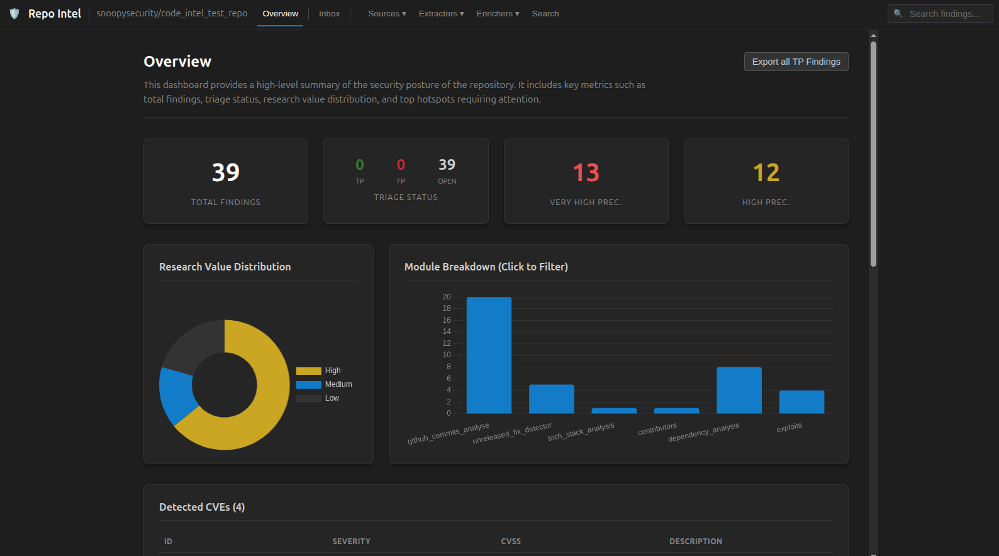

# repo-intel

repo-intel is a mining tool to assist with security code review. It aggregates interesting security related signals from multiple sources—git history, GitHub data, file analysis, and dependencies—to identify the most critical areas of a codebase for security review, as well as gain insights into previous and present security issues within a repository. 

Its primary goal is to **guide human code review** by learning from previous security fixes, vulnerable dependencies, and security-related changes, and highlighting the surrounding code that deserves closer inspection.




## Hotspot Scoring

The dashboard also shows you a list of files you should look at based on previous findings, this is called hotspot.
This model is designed to answer a single question: "What are the main areas someone should review for security issues"

repo-intel uses a **Hotspot Prioritization** model to prioritize findings (0-100). The engine balances:

1.  **Confidence**: How reliable is this signal? (Baseline determined by module, refined by context).
2.  **Research Value**: If real, how useful is it for a human code reviewer to inspect?
3.  **Impact**: What is the blast radius if exploited?

These are combined into a final **Audit Priority** score:

> **Audit Priority = Confidence × (Research Value + Impact) / 2 × 100**

This ensures that we prioritize findings that are **reliable** (High Confidence) and technically critical. See [scoring.md](scoring.md) for details.

## How It Works

```
┌─────────────────────────────────────────────────────────────┐
│                     Context Engine                          │
├─────────────────────────────────────────────────────────────┤
│  Signal Modules:                                            │
│  ┌──────────┐  ┌──────────┐  ┌──────────┐  ┌──────────┐ │
│  │ Git      │  │ GitHub   │  │ Static   │  │ Metadata │ │
│  │ History  │  │ Data     │  │ Analysis │  │ & Deps   │ │
│  └──────────┘  └──────────┘  └──────────┘  └──────────┘ │
├─────────────────────────────────────────────────────────────┤
│  Output:                                                    │
│  1. Prioritized "Audit Hotspots" (Files & CVEs)             │
│  2. Interactive Dashboard with all findings which you can triage             │
└─────────────────────────────────────────────────────────────┘
```


### Module Categories

Modules are grouped into three categories to streamline execution:

| Category | Description |
| :--- | :--- |
| **`sources`** | "Where signals originate". Miners that collect metadata and history (e.g., Git history, GitHub Issues). Includes: `github_commits_analyse`, `github_issues`, `github_prs`, `github_releases_analyse`, `contributors`, `tech_stack` |
| **`extractors`** | "What actively inspects code or artifacts". Static analysis and dependency scanners. Includes: `sast_findings`, `semgrep_file_analysis`, `semgrep_code_intel`, `dependency_analysis`, `unreleased_fix_detector` |
| **`enrichers`** | "What adds external context or intelligence". Post-processing modules. Includes: `exploits` |

You can select entire categories via the `--modules` flag.

Each module collects security-relevant signals:

| Module | What it collects |
|--------|------------------|
| `github_commits_analyse` | CVE references and security keywords from git commit messages (default: last 1000 commits) |
| `github_issues` | Security-related discussions in GitHub Issues (requires `--github-token`, default: 1000 issues/keyword) |
| `github_prs` | Security-related discussions in GitHub Pull Requests (requires `--github-token`, default: 1000 PRs/keyword) |
| `github_releases_analyse` | Security keywords and CVEs in GitHub Releases and Tags (requires `--github-token`) |
| `sast_findings` | Generic SARIF file processor for static analysis findings from tools like Semgrep, Snyk Code, CodeQL, etc. |
| `semgrep_file_analysis` | Scans local files for patterns like TODOs, dangerous functions, and secrets (Security Focus) |
| `semgrep_code_intel` | Scans for application features like Auth, Crypto, Payments, PII, and Admin panels (Intelligence Focus) |
| `dependency_analysis` | Checks for known vulnerabilities in dependencies (osv-scanner) |
| `tech_stack` | Identifies technologies and suggests audit focus areas |
| `contributors` | Identifies files with high churn or many contributors **as supporting context** |
| `unreleased_fix_detector` | Checks if security fixes in commits have been included in a release |
| `exploits` | Enriches CVE findings with exploit intelligence (CISA KEV, EPSS, PoCs) |

The engine correlates historical security fixes, dependency vulnerabilities, and security-related changes to identify **hotspots** — files, commits, CVEs, or dependency paths that historically required security fixes or are adjacent to known weaknesses.


__Which modules run by default?__ All of them! Unless you restrict the list with `--modules`, the tool runs:

   - `github_commits_analyse`
   - `github_issues_analyse`
   - `github_releases_analyse`
   - `github_prs_analyse`
   - `semgrep_file_analysis`
   - `dependency_analysis`
   - `tech_stack`
   - `contributors`
   - `semgrep`
   - __`unreleased_fix_detector`__ 


## Installation

### Prerequisites

- Python 3.8+
- [uv](https://docs.astral.sh/uv/) - A fast Python package installer and resolver

### Option 1: Local Development Setup

1. **Install uv** (if not already installed):

```bash
# macOS/Linux
curl -LsSf https://astral.sh/uv/install.sh | sh

# Windows
powershell -c "irm https://astral.sh/uv/install.ps1 | iex"
```

2. **Clone and Setup**:

```bash
git clone https://github.com/snoopysecurity/repo-intel.git
cd repo-intel
uv sync
```

This creates a virtual environment and installs all dependencies (including dev tools) automatically.

3. **Build Dashboard Frontend** (Required for --serve):

```bash
cd repo_intel/dashboard/frontend
npm install
npm run build
cd ../../../
```

### Option 2: Docker Setup

```bash
# Build the image
docker build -t repo-intel .

# Run help
docker run --rm repo-intel .venv/bin/python .venv/bin/repo-intel --help

# Scan a repository
docker run --rm -v $(pwd)/findings:/app/findings repo-intel .venv/bin/python .venv/bin/repo-intel https://github.com/snoopysecurity/dvws-node

# With GitHub token (recommended for GitHub repos)
docker run --rm -v $(pwd)/findings:/app/findings -e GITHUB_TOKEN=your_token repo-intel .venv/bin/python .venv/bin/repo-intel https://github.com/snoopysecurity/dvws-node --github-token $GITHUB_TOKEN


# Limit GitHub Issues and PRs scan depth (default: 1000 per keyword)
repo-intel --config issues_limit=50 --config prs_limit=50 https://github.com/org/repo


# Serve dashboard from existing findings
docker run --rm -p 8000:8000 -v $(pwd)/findings:/app/findings repo-intel .venv/bin/python .venv/bin/repo-intel /app/findings
```

### Docker Environment Variables

- `GITHUB_TOKEN` - Your GitHub personal access token (for GitHub modules)
- `PYTHONUNBUFFERED` - Set to 1 for better logging (default in Docker)

## Development

### Running Tools

Since uv manages the environment, use `uv run` to ensure you are using the correct versions:

| Task | Command |
|------|---------|
| Run Tests | `uv run pytest` |
| Lint/Fix | `uv run ruff check --fix .` |
| Format | `uv run black .` |
| Type Check | `uv run mypy .` |

## Quick Start

```bash
uv run repo-intel https://github.com/snoopysecurity/dvws-node --serve
```

## Usage

```bash
uv run repo-intel [OPTIONS] [REPO_URL]
```

| Option | Description |
|--------|-------------|
| `REPO_URL` | Positional argument for the repository URL or local path |
| `--target URL` | Alternative to positional argument |
| `-o, --output-dir` | Output directory (default: `findings/{repo}`) |
| `--modules` | Comma-separated list of modules or categories (default: `all`). Supports aliases: `sources`, `extractors`, `enrichers`. |
| `--config` | Pass configuration to modules (e.g. `--config commits_limit=5000`) |
| `--sarif-file` | Path to specific SARIF file for sast_findings module |
| `--github-token` | GitHub API token (required for `github_*` modules) |
| `--throttle` | Delay between API calls (seconds) |
| `--serve` | Start the interactive web dashboard after scanning |
| `--list-modules` | Show available modules and categories |

### Examples

```bash
# Run all modules (commits + github enrichment + file analysis)
repo-intel https://github.com/apache/logging-log4j2 --github-token YOUR_TOKEN --serve

# Just scan commits (fastest)
repo-intel --modules github_commits_analyse https://github.com/lodash/lodash

# Scan ALL commits (default is last 1000)
repo-intel --modules github_commits_analyse --config commits_limit=all https://github.com/lodash/lodash

# Limit GitHub Issues and PRs scan depth (default: 1000 per keyword)
repo-intel --config issues_limit=50 --config prs_limit=50 https://github.com/org/repo

# Process a specific SARIF file
repo-intel --modules sast_findings --sarif-file /path/to/results.sarif /path/to/repo

# Process SARIF file with relative path (file should be in the repo)
repo-intel --modules sast_findings --sarif-file my_scan.sarif /path/to/repo

# Specific target via flag
repo-intel --target https://github.com/org/repo --modules semgrep_file_analysis

# List available modules
repo-intel --list-modules

# Run by category
repo-intel --modules sources          # Recon only
repo-intel --modules extractors       # Code scan only
repo-intel --modules extractors,enrichers # Scan + Exploit check
repo-intel --modules sources,extractors,enrichers # Full analysis
```

## Interactive Dashboard

The tool includes a rich web-based dashboard (launch with `--serve`) to explore findings:

-   **Overview**: Summary statistics and prioritized hotspots.
-   **Priority Focus**: Findings are categorized by Audit Priority (Critical, High, Medium, Low) derived from Confidence and Impact.
-   **Detailed Scoring**: Inspect "Why am I seeing this?" with transparent Confidence and Impact reasons for each finding.
-   **Module Views**: Dedicated pages for each source (Issues, PRs, Commits, Files).
-   **Code Explorer**: Integrated Monaco editor to browse files and see findings in context.
-   **Diff Viewer**: Inspect full multi-file diffs for any security-relevant commit.

## Automated Triage (Beta)

repo-intel can use LLMs to automatically triage findings as True Positives (TP) or False Positives (FP).

### Usage

You can run auto-triage during a scan or on existing findings.

```bash
# Using CLI arguments
repo-intel https://github.com/org/repo \
  --auto-triage \
  --provider openai \
  --api-key sk-your-key

# Using a config file (recommended)
repo-intel https://github.com/org/repo \
  --auto-triage \
  --triage-config triage_config.json
```

### Configuration File (`triage_config.json`)

You can use the included `triage_config_example.json` as a template.

**Note:** Use `$variable` syntax for placeholders. This avoids conflicts with JSON braces in prompts.

Available variables:
- `$title`: Finding title
- `$description`: Finding description
- `$file`: File path
- `$line`: Line number
- `$snippet`: Code snippet (if available)
- `$body`: Additional body content (e.g., Issue/PR body)
- `$metadata`: Full raw metadata (JSON format)

```json
{
  "provider": "openai",
  "api_key": "sk-...",
  "model": "gpt-4",
  "prompt": "You are a senior application security engineer... Analyze the following finding:\n$snippet\nIs this a vulnerability?"
}
```

### Supported Providers

| Provider | Default Model | Env / Config Key |
|----------|---------------|------------------|
| `openai` | `gpt-3.5-turbo` | `api_key` (Required) |
| `gemini` | `gemini-pro`    | `api_key` (Required) |
| `ollama` | `llama2`        | No key required. Uses localhost:11434. |

### Persistence

Triage decisions are saved to `findings/{repo}/triage.json` and persist across re-runs.

## AI Threat Model Generation (Beta)

repo-intel can generate a comprehensive threat model and audit plan by combining repository documentation (markdown files) with confirmed True Positive (TP) findings.

### Prerequisites

1.  **Findings**: You must have findings from a scan.
2.  **Triage**: It is highly recommended to run **Automated Triage** first, as the threat model generator focuses on findings marked as "TP". If no findings are triaged, the generator might miss critical context.

### Usage

```bash
# Generate threat model
repo-intel <repo_url_or_path> \
  --generate-threat-model \
  --provider openai \
  --api-key <YOUR_KEY>

# Using a config file
repo-intel <repo_url_or_path> \
  --generate-threat-model \
  --threat-model-config threat_config.json
```

**Note:** This command reads markdown files from the source code (downloaded during the scan) and combines them with findings to prompt the LLM.

## Output Files

Results are saved to `findings/{repo}/`:

```
findings/{repo}/
├── context.json        # Correlated findings + hotspots
├── audit_start.md      # Human-readable audit guide
├── dashboard.html      # Legacy static dashboard
└── raw_modules/        # Raw output from each module
    ├── github_commits_analyse.json
    ├── github_issues_analyse.json
    ├── github_prs_analyse.json
    └── semgrep_file_analysis.json
```

## Creating Custom Modules

Add new signal sources by creating a module in `repo_intel/modules/`:

```python
from repo_intel.modules.base import SignalModule, register_module

@register_module
class MyModule(SignalModule):
    name = "my_module"
    description = "Collects signals from XYZ"
    
    def collect(self, repo_url, repo_name, **kwargs):
        findings = []
        # Collect signals and return normalized findings
        findings.append(self._make_finding(
            signal_type="my_signal",
            title="Something interesting",
            description="Why this matters",
            severity="high",
            metadata={"file": "path/to/file.js"}
        ))
        return findings
```

Then import it in `repo_intel/modules/__init__.py`.

### Dashboard Integration

Any new module you register will **automatically** appear in the dashboard:
1.  A new tab will be created in the navigation bar using the module's `name`.
2.  Findings will be displayed in a **Generic Module Table** view.
3.  Clicking a finding will open the **Details Modal** showing all metadata.

No frontend code changes are required unless you want a specialized view (like a custom graph or file explorer integration).

## Pattern Engine

The core pattern engine (`repo_intel/core/patterns.py`) provides a centralized, context-aware way to scan for security signals.

### Pattern Structure

Patterns are organized by **confidence** in `repo_intel/patterns/en/`:

```
repo_intel/patterns/en/
├── high_precision/      # Specific, high-confidence indicators
│   ├── security.txt     # e.g., "RCE", "SQL Injection"
│   ├── secrets.txt      # Regex for keys/tokens
│   └── danger.txt       # Dangerous functions (eval, exec)
└── low_precision/       # Generic, noisy keywords
    ├── generic_keywords.txt # e.g., "security", "check", "test"
    └── todo.txt         # TODOs, FIXMEs
```

- **High Precision**: Findings are treated as High Confidence.
- **Low Precision**: Findings are treated as Low Confidence.

### Context Awareness (Filepath Blacklist)

The engine automatically downgrades the confidence of findings if they occur in test or documentation contexts.
- You can configure these paths in `repo_intel/patterns/filepath_blacklist.txt` (default: `test/`, `spec/`, `doc/`, etc.).
- Matches force the finding to **Info** severity.

### Customizing Patterns

You can add your own patterns by creating new `.txt` files in the appropriate directory:

1.  **Add a new category**: Create `repo_intel/patterns/en/high_precision/my_category.txt`.
2.  **Add patterns**: Add keywords (one per line) or regexes (wrapped in `/.../`).

**Example `my_category.txt`:**
```text
/custom_regex_[0-9]+/
specific_keyword
```

### Module Filtering

Modules can choose which pattern categories to use to avoid noise:

```python
match_patterns(
    text, 
    patterns, 
    "en", 
    file_path=rel_path,
    # Only use specific high-value categories
    include_categories=["secrets", "danger", "my_category"],
    # Or exclude noisy ones
    exclude_categories=["generic_keywords"] 
)
```

## Non-Goals

repo-intel is **not**:
- A replacement for manual code review
- A vulnerability scanner that claims completeness
- A tool that auto-flags “exploitable” issues

Its value lies in **reducing review blindness** by using historical security context to focus reviewer effort.

## Contributing

We welcome contributions! Please follow these steps:

1. Fork the repository
2. Create a feature branch (`git checkout -b feature/amazing-feature`)
3. Commit your changes (`git commit -m 'Add amazing feature'`)
4. Push to the branch (`git push origin feature/amazing-feature`)
5. Open a Pull Request

### Adding New Modules

To add a new signal module:

1. Create a new file in `repo_intel/modules/`
2. Inherit from `SignalModule` and use the `@register_module` decorator
3. Import your module in `repo_intel/modules/__init__.py`
4. Update the module categories if needed

See the "Creating Custom Modules" section above for a template.

## Troubleshooting

### Common Issues

**GitHub API Rate Limiting**
- Use `--github-token` with a personal access token
- Adjust `--throttle` to increase delays between requests

**Missing Dependencies**
- Ensure all requirements are installed: `uv sync`
- Some modules require external tools (e.g., `osv-scanner`, `semgrep`)

**Dashboard Not Loading**
- Check that the frontend is built:
  ```bash
  cd repo_intel/dashboard/frontend
  npm install
  npm run build
  ```
- Verify the `--serve` flag is used

**Memory Issues with Large Repos**
- Use `--config commits_limit=1000` to limit commit analysis
- Run specific modules instead of all: `--modules sources,extractors`

### Getting Help

- Open an issue on GitHub for bugs or feature requests
- Check the existing issues for common problems
- Use `--list-modules` to see available modules and their descriptions
